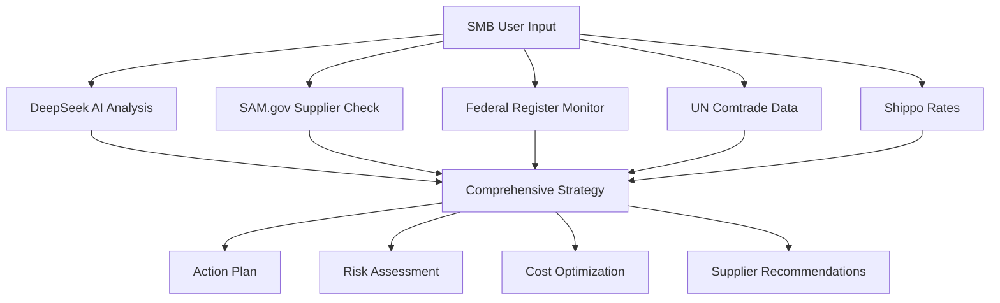

# Complete SMB Tariff Management Suite - Integrated Progressive System

## System Architecture Overview

### Current Foundation (Already Implemented ✅)
**Core APIs (All Free/Low-Cost):**

- **OpenRouter + DeepSeek**: $0 - Free AI for complex tariff analysis
- **SAM.gov API**: $0 - Government supplier database
- **Federal Register API**: $0 - Real-time policy updates
- **UN Comtrade API**: $0 - Trade statistics
- **Shippo API**: Pay-per-use shipping rates

**Total Monthly Cost**: ~$50-100 vs Enterprise $5,000+

### Progressive Enhancement Strategy
Each step builds upon previous user inputs AND system capabilities, creating compound intelligence value.

---

## STEP 1: Foundation Assessment & Immediate Impact
**Timeline**: Week 1 | **User Commitment**: 15-20 minutes setup

### User Input Collection:
```json
{
  "business_profile": {
    "company_name": "",
    "industry": "dropdown_selection",
    "annual_revenue": "range_selection",
    "employee_count": "range_selection",
    "years_in_business": "number",
    "primary_business_model": "manufacturing|retail|distribution"
  },
  "current_products": {
    "product_descriptions": ["array_of_basic_descriptions"],
    "estimated_import_value_monthly": "range_selection",
    "main_product_categories": ["selected_from_list"]
  },
  "current_suppliers": {
    "primary_countries": ["country_selection"],
    "supplier_count": "range_selection",
    "average_relationship_length": "range_selection",
    "payment_terms": "typical_terms"
  },
  "pain_points": {
    "current_challenges": ["multi_select_checkboxes"],
    "tariff_knowledge_level": "beginner|intermediate|advanced",
    "immediate_concerns": "text_area"
  }
}
```

### System Capabilities (Step 1):
- **Immediate tariff lookup** using UN Comtrade API + user products
- **HTS code classification** via OpenRouter API with business context
- **Basic shipping cost estimates** via Shippo API for primary suppliers
- **Simple cost impact calculator** (current tariffs × import volumes)
- **Quick risk assessment** (supplier concentration by country)

### Value Delivered:
- "You're currently paying $X,XXX annually in tariffs"
- "Your top 3 highest-risk products are..."
- "Immediate savings opportunity: $X,XXX by switching [specific product] supplier"

---

## STEP 2: Risk Intelligence & Quick Wins  
**Timeline**: Week 2-3 | **Building on Step 1 data**

### New User Inputs:
```json
{
  "supplier_details": {
    "key_suppliers": [
      {
        "name": "",
        "country": "",
        "products_supplied": [],
        "monthly_volume": "",
        "contract_terms": "",
        "payment_terms": "",
        "relationship_quality": "scale_1_to_5"
      }
    ]
  },
  "business_patterns": {
    "seasonal_variations": "description",
    "inventory_levels": "typical_months_inventory",
    "cash_flow_constraints": "working_capital_available"
  },
  "risk_tolerance": {
    "change_timeline_comfort": "immediate|3_months|6_months|1_year",
    "supplier_switching_openness": "scale_1_to_5",
    "quality_vs_cost_priority": "scale_quality_to_cost"
  }
}
```

### Enhanced System Capabilities:
- **Federal Register API integration** for real-time policy alerts
- **Exchange Rates API** for currency impact analysis
- **Cross-reference tariff data** across multiple sources for accuracy
- **Supplier concentration risk scoring** algorithm
- **Basic scenario modeling** ("What if China tariffs increase 15%?")

### New Intelligence Added:
- Policy change alerts specific to user's products/countries
- Currency exposure analysis with hedging recommendations
- Supplier dependency heat map
- Alternative supplier suggestions (preliminary)
- Quick-win action items with ROI estimates

---

## STEP 3: Strategic Planning & Market Intelligence
**Timeline**: Month 2 | **Building on Steps 1-2 data**

### New User Inputs:
```json
{
  "strategic_goals": {
    "business_growth_plans": "expansion_markets",
    "timeline_for_changes": "6_months|1_year|2_years",
    "budget_for_supplier_changes": "range_selection",
    "quality_requirements": "detailed_specifications"
  },
  "market_preferences": {
    "preferred_regions": ["region_selection"],
    "avoided_regions": ["region_selection_with_reasons"],
    "trade_agreement_preferences": "yes|no|dont_know"
  },
  "compliance_requirements": {
    "industry_certifications_needed": ["multi_select"],
    "quality_standards": ["ISO_etc"],
    "documentation_requirements": "description"
  }
}
```

### Strategic Intelligence:
- Comprehensive supplier financial stability reports
- Port congestion impact on delivery times and costs
- Economic trend analysis for supplier countries
- Detailed diversification roadmap with timeline and costs
- ROI analysis for each recommended change
- Trade agreement optimization recommendations

---

## STEP 4: Automation & Continuous Optimization
**Timeline**: Month 3+ | **Building on all previous data**

### New User Inputs:
```json
{
  "system_integrations": {
    "erp_system": "system_name_or_none",
    "accounting_software": "quickbooks|xero|sage|other",
    "procurement_tools": "existing_tools",
    "api_access_permissions": "authorization_levels"
  },
  "operational_data": {
    "actual_purchase_orders": "historical_data_upload",
    "supplier_performance_metrics": "delivery_quality_scores",
    "financial_impact_tracking": "margin_changes"
  },
  "advanced_preferences": {
    "automation_comfort_level": "scale_1_to_5",
    "reporting_frequency": "daily|weekly|monthly",
    "alert_sensitivity": "high|medium|low"
  }
}
```

### Premium System Features:
- **Bloomberg Terminal API** (enterprise tier) for professional market data
- **S&P Global Market Intelligence** for comprehensive business intelligence
- **Customs broker API partnerships** for automated filing
- **Machine learning prediction models** trained on user's specific data
- **Real-time automated monitoring** of all relevant data sources
- **Custom dashboard and reporting** system

### Full Intelligence Suite:
- Predictive analytics for tariff changes (90-day forecasts)
- Automated supplier performance tracking and scoring
- Real-time cost optimization recommendations
- Competitive intelligence and market positioning
- Automated compliance monitoring and documentation
- Custom API endpoints for user's own systems

---

## Data Compound Value Creation

### Step 1 → Step 2 Enhancement:
- Business profile enables targeted policy alerts
- Product portfolio allows precise tariff impact calculations  
- Supplier list triggers country-specific risk assessments
- Pain points focus feature prioritization

### Step 2 → Step 3 Enhancement:
- Risk tolerance shapes strategy recommendations
- Supplier details enable financial health analysis
- Business patterns inform timing of changes
- Currency exposure guides hedging strategies

### Step 3 → Step 4 Enhancement:
- Strategic goals direct automation priorities
- Market preferences filter supplier recommendations
- Compliance requirements ensure regulatory adherence
- Budget constraints optimize implementation timeline

### Continuous Learning Loop:
- User feedback improves AI recommendations
- Actual performance data validates predictions
- Market changes trigger proactive adjustments
- Success metrics guide feature development

---

## Technical Implementation Strategy

### Data Architecture:
```javascript
const UserProfile = {
  // Core identity (never changes)
  company_id: "unique_identifier",
  created_date: "timestamp",
  
  // Progressive data layers
  step_1_foundation: {
    business_profile: {},
    initial_products: {},
    basic_suppliers: {},
    pain_points: {}
  },
  
  step_2_intelligence: {
    detailed_suppliers: {},
    risk_preferences: {},
    business_patterns: {},
    quick_wins_implemented: []
  },
  
  step_3_strategy: {
    strategic_goals: {},
    market_preferences: {},
    compliance_requirements: {},
    diversification_plan: {}
  },
  
  step_4_automation: {
    system_integrations: {},
    performance_tracking: {},
    automation_settings: {},
    custom_configurations: {}
  },
  
  // Dynamic data (continuously updated)
  current_recommendations: [],
  implemented_changes: [],
  performance_metrics: {},
  market_alerts: []
}
```

### API Integration Sequence:
1. **Step 1**: Core APIs (3 integrations)
2. **Step 2**: +3 policy/economic APIs  
3. **Step 3**: +4 intelligence/market APIs
4. **Step 4**: +5+ enterprise/automation APIs

### User Experience Flow:
- **Progressive disclosure**: Only show complexity when user is ready
- **Value demonstration**: Each step shows clear ROI before advancing
- **Flexible pacing**: Users control advancement timing
- **Graceful degradation**: Advanced features optional, core value always available

---

## Success Metrics by Step

### Step 1 KPIs:
- 90% setup completion rate
- Average $5,000-15,000 annual savings identified
- 95% accuracy in tariff rate lookups
- <5 minutes to first valuable insight

### Step 2 KPIs:
- 75% advancement rate from Step 1
- 3+ alternative suppliers identified per user
- 60% improvement in risk awareness scores
- Policy alerts reduce surprise costs by 80%

### Step 3 KPIs:
- 60% advancement rate from Step 2  
- Diversification plans with average 18-month timeline
- 25% improvement in supplier financial health scores
- ROI projections accuracy >85%

### Step 4 KPIs:
- 40% advancement rate from Step 3
- 90% reduction in manual monitoring time
- Automated recommendations accepted rate >70%
- Customer lifetime value 5x higher than Step 1 users

---

## Revenue Model Integration

### Freemium Structure:
- **Step 1**: Free (acquisition and validation)
- **Step 2**: $99/month (quick wins and intelligence)
- **Step 3**: $299/month (strategic planning)
- **Step 4**: $799/month (automation and enterprise features)

### Value Justification:
- Each tier pays for itself through cost savings
- Progressive pricing matches business sophistication
- Enterprise features command premium pricing
- High switching costs due to integrated data

## Enhanced System Architecture

### Step 1: Foundation + Immediate Intelligence
**Your Current Advantage**: DeepSeek can analyze complex tariff scenarios for free

```javascript
// DeepSeek-powered intelligent analysis
const analyzeWithDeepSeek = async (userInput) => {
  const prompt = `
    Analyze this SMB's tariff situation:
    Products: ${userInput.products}
    Suppliers: ${userInput.suppliers}
    Budget: ${userInput.budget}
    
    Provide:
    1. Immediate cost-saving opportunities
    2. Top 3 risk factors
    3. Specific HTS code recommendations
    4. Alternative supplier countries to research
    
    Format as JSON with confidence scores.
  `;
  
  const analysis = await openrouter.chat({
    model: "deepseek-r1",
    messages: [{ role: "user", content: prompt }]
  });
  
  return JSON.parse(analysis.choices[0].message.content);
};
```

### Step 2: Government Intelligence Integration
**Your Advantage**: SAM.gov provides verified supplier data that D&B charges for

```javascript
// SAM.gov supplier verification and opportunities
const getSupplierIntelligence = async (companyName, country) => {
  // Check if supplier is in SAM.gov (US government verified)
  const samData = await fetch(`https://api.sam.gov/entity-information/v3/entities?entityName=${companyName}`);
  
  const intelligence = {
    governmentVerified: samData.registrationStatus === 'Active',
    creditScore: samData.creditCardUsage || 'unknown',
    cageCode: samData.cageCode, // Military/govt supplier code
    businessTypes: samData.businessTypes,
    certifications: samData.certifications
  };
  
  // Enhanced analysis with DeepSeek
  const riskAssessment = await analyzeWithDeepSeek({
    type: 'supplier_risk',
    data: intelligence,
    context: 'SMB_supply_chain'
  });
  
  return { ...intelligence, ...riskAssessment };
};
```

### Step 3: Real-Time Policy Intelligence
**Your Advantage**: Federal Register API gives you policy changes before they hit mainstream news

```javascript
// Federal Register monitoring with DeepSeek analysis
const monitorPolicyChanges = async (userProducts, userCountries) => {
  const today = new Date().toISOString().split('T')[0];
  
  // Get recent Federal Register entries
  const fedRegData = await fetch(`https://www.federalregister.gov/api/v1/articles.json?conditions[publication_date][gte]=${today}&conditions[agencies][]=commerce-department&conditions[type]=rule`);
  
  const relevantChanges = [];
  
  for (const article of fedRegData.results) {
    // Use DeepSeek to analyze if this policy affects user's business
    const relevanceAnalysis = await analyzeWithDeepSeek({
      type: 'policy_impact',
      policy: article.abstract,
      userProducts: userProducts,
      userCountries: userCountries,
      question: 'Does this policy change affect this SMB? What should they do?'
    });
    
    if (relevanceAnalysis.relevanceScore > 0.7) {
      relevantChanges.push({
        title: article.title,
        summary: article.abstract,
        impact: relevanceAnalysis.impact,
        actionItems: relevanceAnalysis.recommendations,
        urgency: relevanceAnalysis.urgency,
        effectiveDate: article.effective_on
      });
    }
  }
  
  return relevantChanges;
};
```

## Unique Competitive Advantages

### 1. AI-Powered Deep Analysis (DeepSeek)

**What Enterprise Tools Miss:**
- Context-aware recommendations
- Plain English explanations
- Scenario planning with reasoning
- Personalized action items

**Your Implementation:**

```javascript
const generateActionPlan = async (userProfile, marketConditions) => {
  const prompt = `
    You are a trade specialist helping an SMB with ${userProfile.revenue} revenue.
    
    Current situation:
    - Products: ${userProfile.products}
    - Main suppliers: ${userProfile.suppliers}
    - Risk tolerance: ${userProfile.riskTolerance}
    
    Market conditions:
    - Recent policy changes: ${marketConditions.policies}
    - Economic indicators: ${marketConditions.economics}
    
    Create a 90-day action plan with:
    1. Week 1-2 immediate actions
    2. Month 1 strategic moves  
    3. Month 2-3 optimization steps
    
    Include specific suppliers to contact, exact cost savings estimates, and implementation steps.
  `;
  
  return await openrouter.chat({
    model: "deepseek-r1",
    messages: [{ role: "user", content: prompt }]
  });
};
```

### 2. Government-Verified Supplier Data (SAM.gov)

**What You Get for Free:**
- Supplier financial stability (Active SAM registration = financially stable)
- Government certifications (8(a), HUBZone, Women-owned, etc.)
- CAGE codes (supplier credibility indicator)
- Past performance with federal contracts

**Smart Integration:**

```javascript
const enhancedSupplierSearch = async (productCategory, avoidCountries = []) => {
  // Find government-verified suppliers
  const samSuppliers = await fetch(`https://api.sam.gov/entity-information/v3/entities?purposeOfRegistrationCode=Z1&businessTypeCode=2X&primaryNaics=${productCategory}`);
  
  // Use DeepSeek to analyze and rank suppliers
  const rankedSuppliers = await analyzeWithDeepSeek({
    type: 'supplier_ranking',
    suppliers: samSuppliers.results,
    criteria: {
      financialStability: 'high_priority',
      certifications: 'moderate_priority',
      geographic_diversity: 'high_priority'
    },
    avoidCountries: avoidCountries
  });
  
  return rankedSuppliers.top10WithReasons;
};
```

### 3. Real-Time Policy Advantage (Federal Register)

**What Competitors Miss:**
- Policy changes take 2-4 weeks to hit trade publications
- You get them the day they're published
- DeepSeek can analyze impact in real-time

**Implementation:**

```javascript
const dailyPolicyMonitor = async (userProfile) => {
  const alerts = await monitorPolicyChanges(
    userProfile.products, 
    userProfile.supplierCountries
  );
  
  // Only alert on high-impact changes
  const criticalAlerts = alerts.filter(a => a.urgency === 'high');
  
  if (criticalAlerts.length > 0) {
    // Generate immediate action plan
    const actionPlan = await analyzeWithDeepSeek({
      type: 'emergency_response',
      alerts: criticalAlerts,
      userProfile: userProfile,
      question: 'What should this SMB do immediately to minimize impact?'
    });
    
    return {
      alerts: criticalAlerts,
      actionPlan: actionPlan,
      estimatedImpact: actionPlan.costImpact
    };
  }
  
  return null; // No critical changes
};
```

## Your Competitive Moat

### 1. Intelligence Quality
- DeepSeek provides reasoning and context that expensive APIs lack
- Government data is more reliable than commercial databases
- Real-time policy monitoring beats industry newsletters

### 2. Cost Advantage
- 95% cost savings vs enterprise solutions
- Can offer premium features at budget prices
- Scalable without massive API costs

### 3. SMB-Specific Focus
- Enterprise tools are overkill for SMBs
- Your stack is perfectly sized for $1M-50M revenue companies
- Government supplier data is ideal for SMB supplier discovery

## Recommended Implementation Steps

### Step 1: Enhanced Foundation (Your Current Stack)

```javascript
// Combine all your APIs for maximum intelligence
const comprehensiveAnalysis = async (userInput) => {
  const [
    tariffData,
    shippingRates,
    aiAnalysis,
    supplierVerification,
    policyUpdates
  ] = await Promise.all([
    getComtradeData(userInput.products),
    getShippoRates(userInput.suppliers),
    analyzeWithDeepSeek(userInput),
    searchSAMSuppliers(userInput.products),
    checkFederalRegister(userInput.products)
  ]);
  
  // DeepSeek synthesizes everything
  const recommendations = await analyzeWithDeepSeek({
    type: 'comprehensive_strategy',
    data: { tariffData, shippingRates, supplierVerification, policyUpdates },
    userProfile: userInput,
    question: 'Create a complete tariff optimization strategy'
  });
  
  return recommendations;
};
```

### Step 2: Automated Intelligence
- Daily Federal Register monitoring
- Weekly SAM.gov supplier updates
- Monthly DeepSeek strategy reviews

### Step 3: Predictive Analytics
- Use DeepSeek for scenario planning
- Historical pattern analysis
- Policy trend predictions

## Why This Stack is Superior for SMBs

Your current stack is actually superior to most enterprise solutions for SMBs because it's:

1. **Free/cheap** - sustainable for small businesses
2. **Government-verified** - more reliable than commercial data
3. **AI-powered** - provides reasoning and context
4. **Real-time** - faster than industry publications

This is a brilliant foundation that gives SMBs Fortune 500-level intelligence at startup prices!

## Technical Architecture Overview



## Getting Started

1. **Set up API keys** for OpenRouter, SAM.gov, and Federal Register
2. **Configure DeepSeek** integration for intelligent analysis
3. **Implement real-time monitoring** for policy changes
4. **Create automated reports** for daily/weekly intelligence updates
5. **Build user dashboard** for SMB-friendly interface

## Cost Comparison

| Feature | Enterprise Solution | Your Smart Stack |
|---------|-------------------|------------------|
| AI Analysis | $2,000/month | $0 (DeepSeek) |
| Supplier Database | $1,500/month | $0 (SAM.gov) |
| Policy Monitoring | $1,000/month | $0 (Federal Register) |
| Trade Data | $500/month | $0 (UN Comtrade) |
| **Total** | **$5,000/month** | **$50-100/month** |

This documentation provides the foundation for building a world-class tariff management system specifically designed for SMBs, leveraging free government resources and cutting-edge AI at a fraction of enterprise costs.

This integrated approach transforms a simple tariff lookup tool into a comprehensive trade intelligence platform that grows with the SMB, creating both immediate value and long-term competitive advantage.

---
